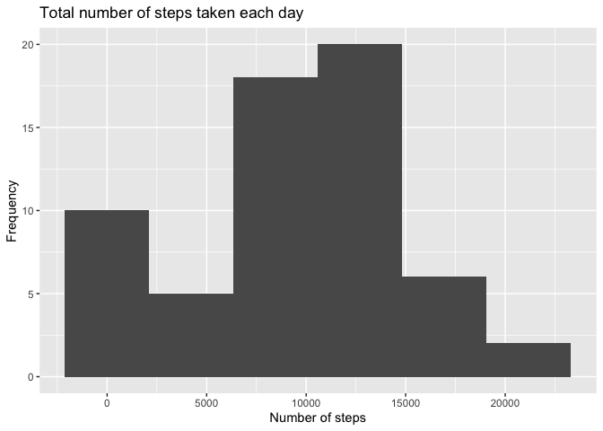
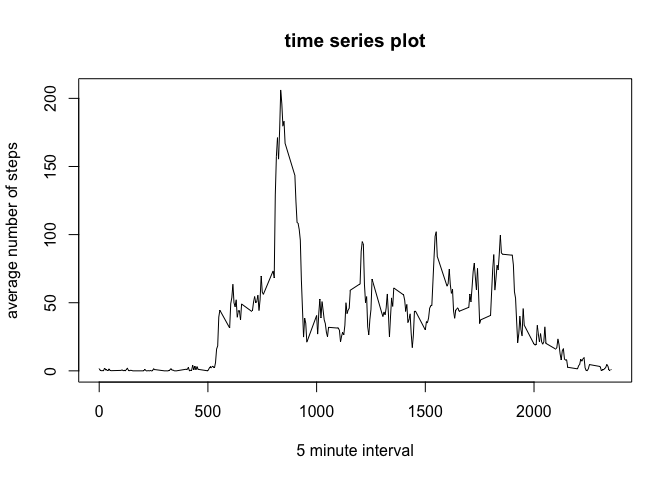
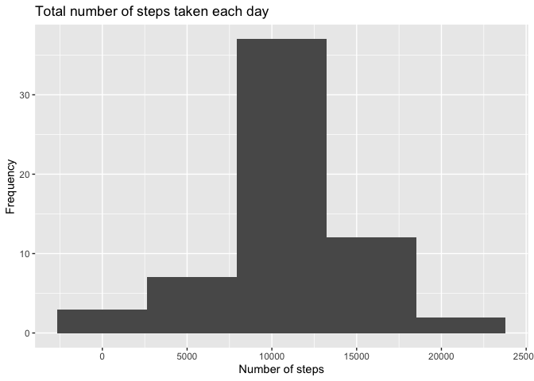
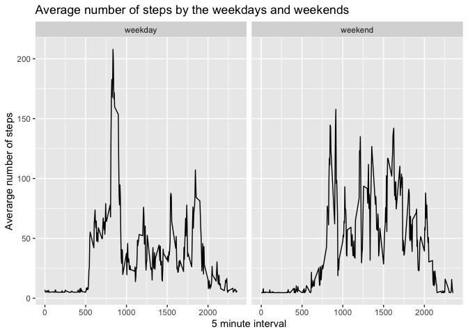

## Loading and preprocessing the data

```r
path=getwd()
zip_file=file.path(getwd(), "activity.zip")
unzip(zipfile = zip_file)
data=read.csv("activity.csv")
str(data)
```

```
## 'data.frame':	17568 obs. of  3 variables:
##  $ steps   : int  NA NA NA NA NA NA NA NA NA NA ...
##  $ date    : Factor w/ 61 levels "2012-10-01","2012-10-02",..: 1 1 1 1 1 1 1 1 1 1 ...
##  $ interval: int  0 5 10 15 20 25 30 35 40 45 ...
```

```r
data$date=as.Date(as.character(data$date), "%Y-%m-%d")
```


## What is mean total number of steps taken per day?

```r
library(plyr)
library(ggplot2)
mn=ddply(data, "date", summarise, steps = sum(steps, na.rm = TRUE))
ggplot(mn, aes(steps)) + 
        geom_histogram(bins = 6) +
        ggtitle("Total number of steps taken each day") + 
        xlab("Number of steps") + ylab("Frequency")
```

<!-- -->


Mean and Median of the Total number of steps taken per day are 9354.23 and 10395 respectively.

## What is the average daily activity pattern?

```r
minst= as.data.frame(tapply(data$steps, data$interval, mean, na.rm = T))
int=subset(data, data$date=="2012-10-01")
int=int[,3]
tot=cbind(minst, int)
plot(tot[,2], tot[,1], type='l', xlab="5 minute interval", ylab="average number of steps", main="time series plot")
```

<!-- -->


5-minute interval is 104 with the maximum number of 206.1698113 steps

## Imputing missing values


```r
d1=sum(is.na(data$steps==TRUE))
d2=sum(is.na(data$date==TRUE))
d3=sum(is.na(data$interval==TRUE))
imp=sum(apply(data, 1, anyNA))
```

NA values exists only in steps data where total amount is 2304 so we have to replace NA values only in steps data. Date and interval data has no NA values: 0 and 0 respectively. Thus, the total value of NA values is 2304. 

As median of steps data is 0, I will use mean of the steps data to replace the NA values in the steps dataset. 


```r
data1=data
for (i in 1:length(data[,1])){
        if(is.na(data1[i,1])==TRUE){
        data1[i,1]=mean(data[,1], na.rm = TRUE)
        }
}
sum(is.na(data1))
```

```
## [1] 0
```

Histogram of total number of steps taken each day:

```r
mn1=ddply(data1, "date", summarise, steps = sum(steps))
ggplot(mn1, aes(steps)) + 
        geom_histogram(bins = 5) +
        ggtitle("Total number of steps taken each day") + 
        xlab("Number of steps") + ylab("Frequency")
```

<!-- -->


Mean and Median of the Total number of steps taken per day are 10766.19 and 10766.19 respectively.

## Are there differences in activity patterns between weekdays and weekends?


```r
dd=c("Monday", "Tuesday", "Wednesday", "Thursday", "Friday")
wkd1=weekdays(data[,2])
wkd=ifelse(wkd1 %in% dd, "weekday", "weekend")
wkd=as.factor(wkd)
data1=cbind(data1, wkd)
colnames(data1)[4]="day"
```

Weekdays and weekend data was added to the previously created dataset and below is the first 6 lines of new created dataset:


```
##     steps       date interval     day
## 1 37.3826 2012-10-01        0 weekday
## 2 37.3826 2012-10-01        5 weekday
## 3 37.3826 2012-10-01       10 weekday
## 4 37.3826 2012-10-01       15 weekday
## 5 37.3826 2012-10-01       20 weekday
## 6 37.3826 2012-10-01       25 weekday
```

Final plot of the average steps by the weekdays and weekends:


```r
final1=ddply(data1, .(interval, day), summarise, steps = mean(steps))

qplot(x=interval, y=steps, data=final1, facets=.~day, geom="line", xlab="5 minute interval", ylab="Averarge number of steps", main="Average number of steps by the weekdays and weekends")
```

<!-- -->
